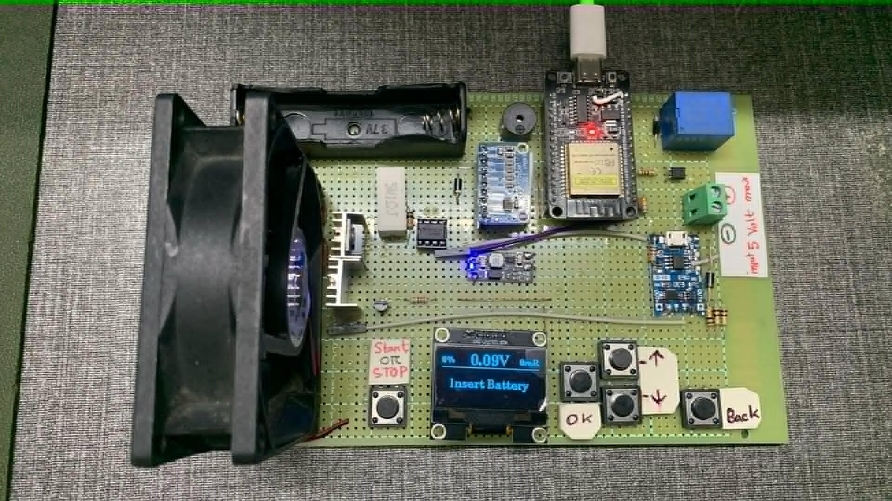
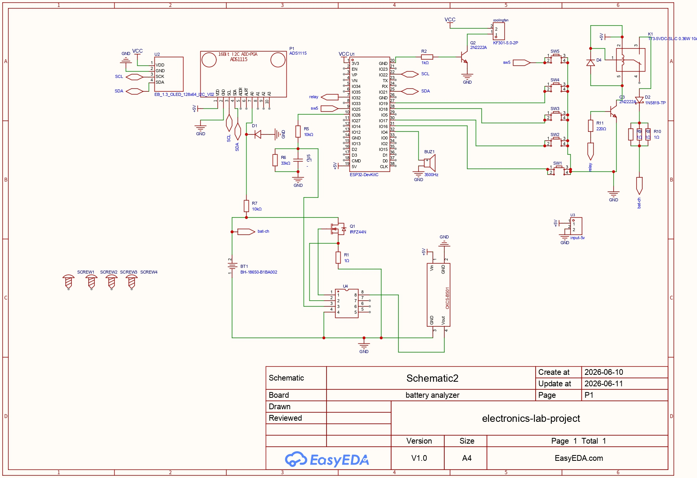

<h1>🔋 ESP32 Based Lithium-Ion Battery Analyzer</h1>

An intelligent battery analyzer designed to evaluate Lithium-Ion battery health by
measuring voltage, capacity, internal resistance, and performing controlled constant-current discharge.

---

<h2>📖 About the Project</h2>

This project is an ESP32-based Battery Analyzer capable of automatically evaluating
Lithium-Ion batteries. The system performs voltage monitoring, constant current
discharge, battery capacity estimation, and internal resistance measurement while
displaying real-time information on an OLED display.

---
<h2>🚨 Problem Statement</h2>

Lithium-Ion batteries are widely used in smartphones, laptops, electric vehicles,
power banks, drones, and IoT devices. Despite their widespread use, determining
the actual health of a battery remains a significant challenge.

Most affordable battery testers available in the market only display the battery
voltage. However, battery voltage alone cannot accurately determine the remaining
capacity or overall health of a battery. A battery may still show a normal voltage
while suffering from reduced capacity, increased internal resistance, and poor
performance under load.

Professional battery analyzers provide accurate measurements but are often
expensive, bulky, and inaccessible for students, hobbyists, repair technicians,
and educational laboratories.

---

<h2>💡 Proposed Solution</h2>

This project presents a low-cost, portable, and open-source Battery Analyzer
powered by the ESP32 microcontroller.

The analyzer performs automated battery diagnostics by measuring multiple battery
health parameters instead of relying only on voltage. It combines precision
voltage sensing, constant-current discharge control, capacity estimation,
internal resistance calculation, and real-time monitoring into a single compact
device.

The system provides an affordable alternative to expensive commercial battery
analyzers while maintaining reliable measurement accuracy for educational,
research, and repair applications.

---

<h2>⭐ Why is this Different?</h2>

Unlike conventional low-cost battery testers, this project performs a complete
battery health analysis instead of displaying only battery voltage.

By integrating an ESP32, ADS1115 ADC, LM358 operational amplifier, and MOSFET-
based electronic load, the analyzer is capable of maintaining a stable constant
discharge current while calculating battery capacity and internal resistance in
real time.

Its open-source architecture also allows developers and researchers to customize,
extend, and integrate additional features such as cloud monitoring, data logging,
and machine learning-based battery health prediction.

---

<h2>✨ Features</h2>

<ul>
<li>🔋 Automatic Battery Detection</li>
<li>📊 Real-Time Voltage Monitoring</li>
<li>⚡ Constant Current Discharge</li>
<li>📈 Capacity Measurement (mAh)</li>
<li>📉 Internal Resistance Measurement (mΩ)</li>
<li>🌡️ Temperature Controlled Cooling Fan</li>
<li>📟 OLED Live Display</li>
<li>🌐 ESP32 Wi-Fi Ready</li>
</ul>

---

<h2>🛠 Hardware Components</h2>

<table>
<tr>
<th>Component</th>
<th>Purpose</th>
</tr>

<tr>
<td>ESP32</td>
<td>Main Controller</td>
</tr>

<tr>
<td>ADS1115</td>
<td>16-bit ADC Voltage Measurement</td>
</tr>

<tr>
<td>LM358</td>
<td>Constant Current Controller</td>
</tr>

<tr>
<td>IRFZ44N</td>
<td>Electronic Load MOSFET</td>
</tr>

<tr>
<td>1Ω 10W Resistor</td>
<td>Current Sensing</td>
</tr>

<tr>
<td>OLED Display</td>
<td>User Interface</td>
</tr>

<tr>
<td>Mini360 Buck Converter</td>
<td>Voltage Regulation</td>
</tr>

<tr>
<td>Cooling Fan</td>
<td>Thermal Management</td>
</tr>

</table>

---

<h2>⚙️ Working Principle</h2>

<ol>

<li>
Battery voltage is measured using the ADS1115 ADC.
</li>

<li>
ESP32 generates a PWM signal which is converted into a reference voltage through a low-pass filter.
</li>

<li>
LM358 compares the reference voltage with the sensing resistor voltage and adjusts the MOSFET gate to maintain a constant discharge current.
</li>

<li>
Battery capacity is calculated from discharge current and elapsed time.
</li>

<li>
Internal resistance is calculated by comparing open-circuit voltage and loaded voltage.
</li>

<li>
Cooling fan automatically turns on when required.
</li>

</ol>

---

<h2>📊 Comparison with Existing Battery Testers</h2>

<table>

<tr>
<th>Feature</th>
<th>Low-Cost Tester</th>
<th>Professional Analyzer</th>
<th>This Project</th>
</tr>

<tr>
<td>Voltage Measurement</td>
<td>✅</td>
<td>✅</td>
<td>✅</td>
</tr>

<tr>
<td>Capacity Estimation</td>
<td>❌</td>
<td>✅</td>
<td>✅</td>
</tr>

<tr>
<td>Internal Resistance Measurement</td>
<td>❌</td>
<td>✅</td>
<td>✅</td>
</tr>

<tr>
<td>Constant Current Discharge</td>
<td>❌</td>
<td>✅</td>
<td>✅</td>
</tr>

<tr>
<td>OLED Display</td>
<td>❌</td>
<td>✅</td>
<td>✅</td>
</tr>

<tr>
<td>ESP32 Wi-Fi Support</td>
<td>❌</td>
<td>Limited</td>
<td>✅</td>
</tr>

<tr>
<td>Open Source</td>
<td>❌</td>
<td>❌</td>
<td>✅</td>
</tr>

<tr>
<td>Affordable</td>
<td>✅</td>
<td>❌</td>
<td>✅</td>
</tr>

</table>

---

<h2>🎯 Project Objectives</h2>

<ul>

<li>Develop a low-cost Lithium-Ion Battery Analyzer.</li>

<li>Measure battery voltage with high precision.</li>

<li>Estimate actual battery capacity (mAh).</li>

<li>Measure internal resistance (mΩ).</li>

<li>Maintain constant current using an LM358 and MOSFET.</li>

<li>Display live battery information on an OLED display.</li>

<li>Provide an open-source platform for battery research and education.</li>

</ul>

---

<h2>🌍 Real-World Applications</h2>

<ul>

<li>🔋 Battery Repair & Refurbishment</li>

<li>📱 Smartphone & Laptop Battery Diagnostics</li>

<li>🚗 Electric Vehicle Battery Maintenance</li>

<li>🧪 Engineering Research Laboratories</li>

<li>🎓 University Projects & Education</li>

<li>⚡ DIY Electronics and Maker Communities</li>

<li>🏭 Battery Quality Inspection</li>

</ul>
<h2>📂 Project Structure</h2>

<pre>
Battery-Analyzer/
│
├── firmware/
├── hardware/
├── circuit/
├── images/
├── docs/
└── README.md
</pre>

---

  

---

<h2>🚀 Future Improvements</h2>

<ul>

<li>Battery Charging Module</li>

<li>Web Dashboard</li>

<li>Cloud Data Logging</li>

<li>CSV Export</li>

<li>Machine Learning Based Battery Health Prediction</li>

<li>Support for Multiple Battery Types</li>

</ul>

---
<h2>📽️ Project Presentation</h2>

This repository includes the complete project presentation describing the problem,
system architecture, hardware design, working principle, implementation, and future improvements.

<a href="Slide/Battery_Analyzer_Presentation.pptx">
  📊 Battery Analyzer Presentation (PPTX)
</a>
---
<h2>📚 Applications</h2>

<ul>

<li>Battery Repair Shops</li>

<li>Research Laboratories</li>

<li>Educational Projects</li>

<li>Quality Control</li>

<li>DIY Electronics</li>

</ul>

---

<h2>👨‍💻 Author</h2>

<b>Shahriar Kabir Saikat</b>

 

B.Sc. in Computer Science & Engineering

 

United International University (UIU)

  

⭐ If you like this project, consider giving it a Star.

